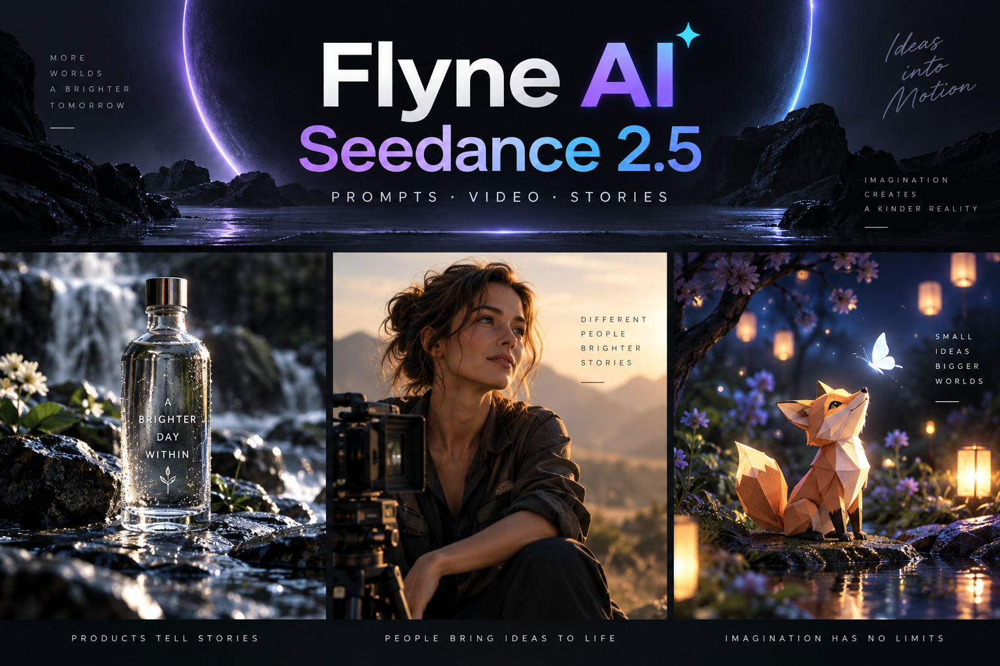

# Prompts para Seedance 2.5: guía práctica de imagen a vídeo

[English](README.md) · [简体中文](README_ZH.md) · [日本語](README_JA.md) · [Español](README_ES.md) · [Prompts en 15 idiomas](prompts/i18n/README.md)



Biblioteca original con **120 prompts para Seedance 2.5 y soporte para 15 idiomas**: 60 escenas generales y 60 flujos profesionales en inglés para producción, edición, ecommerce, cine de género, vídeo social, animación original, experimentos visuales, educación y accesibilidad.

Comparte un prompt original y probado mediante el [formulario de contribución](https://github.com/flyneai/awesome-seedance-2-5-prompt/issues/new?template=prompt.yml), incluyendo ajustes, entradas y el resultado real. Las propuestas aceptadas pueden publicarse con atribución después de su revisión.

> **Usar Seedance 2.5 en Flyne AI:** elige [Text-to-Video](https://flyne.ai/model/seedance-2-5/) si partes de una idea o un guion, o [Image-to-Video](https://flyne.ai/model/seedance-2-5/) si necesitas conservar un producto, una persona o una composición.
>
> Los parámetros, precios, requisitos de entrada pueden cambiar. Consulta siempre las páginas de Flyne AI para conocer los detalles actuales.

## Crea con Flyne AI

Crea vídeos de productos, retratos e historias cortas. Comprueba los ajustes y el coste antes de generar.

[Flyne AI →](https://flyne.ai/model/seedance-2-5/) · [Workflow guide](docs/flyne-ai-guide.md)

## Cómo escribir un buen prompt para Seedance 2.5

La página oficial destaca vídeos de hasta 30 segundos en una generación, dos extensiones, una interpretación más precisa de los vídeos de referencia, edición audiovisual, cámara profesional, bloqueo de actores, control mediante modelos blancos y edición con fondo verde. Conviene escribir un pequeño brief de dirección, no una lista de adjetivos.

```text
[Modo] Texto / Imagen / Referencia / Edición
[Objetivo] Uso, público, emoción, duración y formato
[Función de cada referencia] Imagen 1 fija la identidad; Vídeo 1 solo aporta la cámara
[Anclas visuales] Persona, vestuario, producto, escenario, hora y luz
[Cronología] Presentación -> acción -> giro -> plano final
[Cámara] Tamaño de plano, altura, recorrido, velocidad, foco y parada
[Interpretación y física] Mirada, manos, peso, inercia, contacto, tela y agua
[Audio] Diálogo, ambiente, foley, música y puntos de sincronía
[Continuidad] Elementos que no pueden cambiar
[Evitar] Deformaciones, duplicados, extremidades extra, texto falso, logos y marcas de agua
```

## Ejemplo listo para copiar: café bajo la lluvia

```text
Usa la imagen de entrada como única referencia visual. Conserva el rostro, el peinado, la chaqueta azul marino, los objetos de la mesa, la distribución de la cafetería y la dirección de la luz de la mañana.

Crea una toma única y estable de 12 segundos. Empieza con un plano macro del vapor de la taza; después, aleja la cámara lentamente mientras se desplaza hacia la derecha. La persona cierra el libro, mira la ventana bajo la lluvia y sonríe de forma sutil. Las gotas bajan por el cristal y los clientes del fondo realizan solo movimientos pequeños y naturales. Termina con un plano medio estable que encuadre a la persona y la ventana.

Audio: lluvia, libro al cerrarse, un leve sonido de taza y plato, y ambiente tranquilo. No añadas personas, no cambies identidad, ropa ni cantidad de objetos, no sacudas la cámara y no generes texto falso, logotipos, subtítulos ni marcas de agua.
```

## Biblioteca completa

El [índice maestro de 120 escenas](prompts/README.md) combina una [biblioteca base de 24 escenas](prompts/prompt-library.md), una [ampliación de 36 escenas](prompts/extended-scenarios.md), [12 flujos profesionales](prompts/advanced-workflows.en.md), [28 técnicas creativas](prompts/creative-techniques.en.md) y [20 experimentos de género y vídeo social](prompts/genre-social-experiments.en.md). Incluye:

- drama cinematográfico y ciencia ficción;
- anuncios de bebidas, cosmética y wearables;
- UGC vertical, diarios de viaje y reseñas gastronómicas;
- papel artesanal, plastilina y murales animados;
- escalada, tenis y baile urbano;
- jazz, ASMR de panadería y ficción radiofónica;
- microexpresiones, paralaje arquitectónico y fotogramas inicial/final;
- croma verde, previs con modelo blanco, cámara de referencia y edición precisa.

El archivo [prompts completos en español](prompts/i18n/prompt-library.es.md) contiene seis recetas listas para copiar. Consulta el [directorio de 15 idiomas](prompts/i18n/README.md), que también incluye italiano, tailandés y vietnamita.

## Lista de control para imagen a vídeo

- Bloquea la identidad, ropa, geometría del producto, cantidad de objetos, composición y luz principal.
- Separa el movimiento del sujeto, del entorno y de la cámara.
- Asigna una sola función a cada archivo de referencia.
- Describe inicio, recorrido, velocidad y punto final de la cámara.
- Reserva los últimos 4–6 segundos para frenar y cerrar la composición.
- Usa únicamente personas, música, voces, marcas e imágenes propias o autorizadas.

Todos los prompts, escenarios, textos explicativos e imágenes de este repositorio fueron creados de nuevo para esta colección. Los ejemplos evitan celebridades, lemas de terceros y personajes protegidos. Revisa derechos de autor, imagen, marca, audio, seguridad y políticas de la plataforma antes de cualquier uso comercial.
