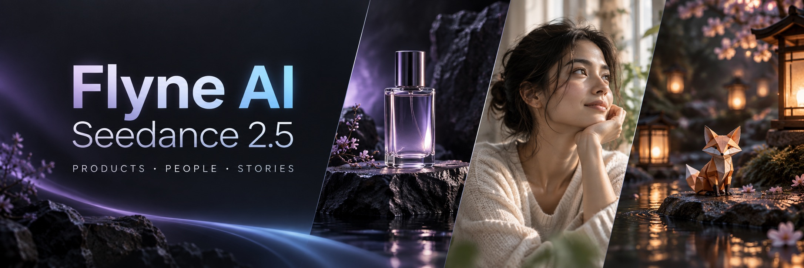

# Prompts Seedance 2.5: guia em português

[English](README.md) · [简体中文](README_ZH.md) · [日本語](README_JA.md) · [Español](README_ES.md) · [Todos os 15 idiomas](prompts/i18n/README.md)

[](https://flyne.ai/model/seedance-2-5/)

Esta imagem é uma ilustração promocional, não uma captura de um vídeo gerado.

[Exemplos de vídeo (inglês)](docs/community-videos.md) · [Baixar prompts de prática (inglês e chinês)](prompts/community/README.md)

> As 120 receitas principais estão em chinês e inglês. Os 15 idiomas oferecem seis cenas de prática comuns, não a tradução integral de todas as receitas.

Este repositório reúne **120 receitas de vídeo originais para Seedance 2.5** e oferece suporte a **15 idiomas**: 60 cenas gerais e 60 fluxos em inglês, incluindo filmes de gênero, vídeo social, animação original e experimentos visuais.

Experimente o [Seedance 2.5 no Flyne AI](https://flyne.ai/model/seedance-2-5/), com suporte à criação de vídeos com pessoas reais. Use os prompts desta coleção para dar vida aos seus personagens e histórias e explore o [Flyne AI Create](https://flyne.ai/create/) para acessar mais ferramentas e possibilidades criativas.

Compartilhe um prompt original e testado pelo [formulário de contribuição](https://github.com/flyneai/awesome-seedance-2-5-prompt/issues/new?template=prompt.yml), incluindo configurações, entradas e o resultado real. Contribuições aprovadas podem ser publicadas com atribuição após revisão.

## Crie com Flyne AI

Crie vídeos de produtos, retratos e histórias curtas. Confira as configurações e o custo antes de gerar.

[Flyne AI →](https://flyne.ai/model/seedance-2-5/) · [Guia de uso (inglês e chinês)](docs/flyne-ai-guide.md)

## Comece por aqui

- Copie os [6 prompts completos em português do Brasil](prompts/i18n/prompt-library.pt-BR.md).
- Encontre um exemplo no [índice com 120 cenas](prompts/README.md), incluindo [20 prompts de gênero, social e experimentação](prompts/genre-social-experiments.en.md).
- Use o [guia avançado de prompts](docs/prompting-guide.md) para câmera, ritmo, áudio e consistência.
- Escolha no Flyne AI entre [Text-to-Video](https://flyne.ai/model/seedance-2-5/) e [Image-to-Video](https://flyne.ai/model/seedance-2-5/).

> Parâmetros, preços, requisitos de entrada podem mudar. Consulte as páginas da Flyne AI para obter as informações atuais.

## Estrutura recomendada

```text
[Objetivo] público, canal, duração e proporção
[Referências] uma função clara para cada imagem ou vídeo
[Invariáveis] identidade, produto, cenário e luz que não podem mudar
[Linha do tempo] abertura → ação → virada → quadro final
[Câmera] enquadramento, altura, trajeto, velocidade, foco e parada
[Áudio] fala, ambiente, efeitos, música e pontos de sincronização
[Evitar] deriva, duplicação, anatomia, texto falso, logotipos e marca-d'água
```

[Esta edição adapta a coleção de código aberto da FLAQ para a Flyne AI. Fontes e direitos (inglês)](docs/PROVENANCE.md).

## Seja parceiro do Flyne AI

O Flyne AI oferece um programa de afiliados. Compartilhe nossas ferramentas de criação de imagens e vídeos com IA em tutoriais, avaliações ou fluxos de trabalho criativos e receba comissões por indicações que atendam aos requisitos.

[Conheça o programa de afiliados do Flyne AI](https://flyne.ai/affiliate-program/)
