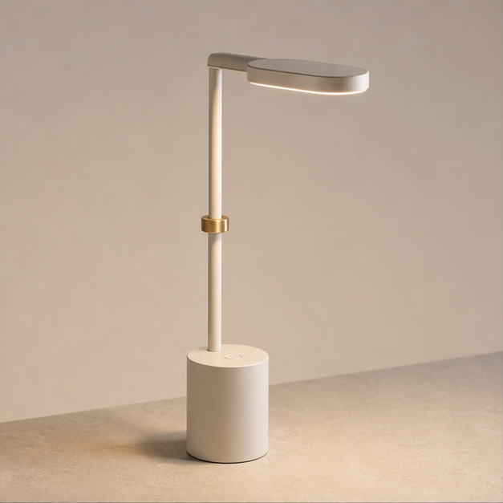
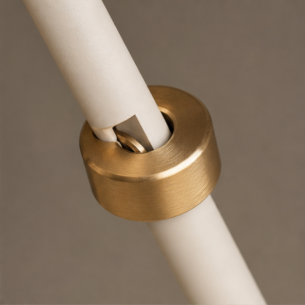
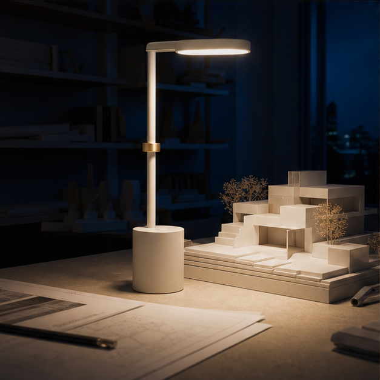
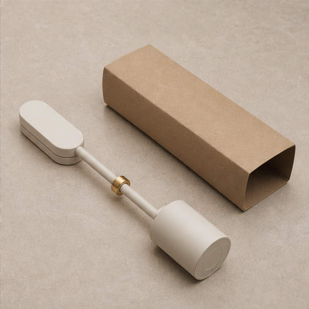

# 灯具参考图：上传顺序 / Lamp reference upload order

[配方 100 / Recipe 100](../../prompts/creative-techniques.en.md#100-reference-board-product-campaign-storyboard) · [原四宫格 / Original board](../modular-lamp-reference-board.png) · [来源与许可 / Source and license](../../docs/PROVENANCE.md)

四张图片由上游参考板按中心线裁切，每张 627×627 像素，未重新生成。请按文件编号上传，仅在所选平台明确支持多图参考时使用；普通单图模式不等于支持四张图。参见[平台功能对照](../../docs/flyne-ai-guide.md#配方与平台功能怎么对应)。

The four 627×627 images are exact quadrant crops of the upstream board, not regenerated artwork. Upload in numbered order only when the selected mode supports multiple references. See the [platform guide](../../docs/flyne-ai-guide.md#match-the-recipe-to-the-available-mode).

| 上传顺序 / Order | 文件 / File | 用途 / Role |
|---|---|---|
| Image 1 | [01-product.png](01-product.png) | 整体外观 / Overall product identity |
| Image 2 | [02-detail.png](02-detail.png) | 黄铜环局部 / Brass-ring detail insert |
| Image 3 | [03-environment.png](03-environment.png) | 夜间桌面与照明 / Nighttime desk and lighting |
| Image 4 | [04-final-state.png](04-final-state.png) | 最终横放构图 / Final laid-down composition |

这些是概念参考图，并非实测产品或视频结果。第四张可见的是灯具横放在包装旁，不足以证明折叠机构或折叠过程。原配方要求折叠；若使用这组图，建议将该动作改为“轻轻放平灯具，停在图 4 的构图”，或者换成结构经过确认的产品参考图。各图的细节也需要人工检查，不能保证模型能自动统一结构。

These are concept references, not tested hardware or rendered-video results. Image 4 shows the lamp laid down beside packaging; it does not establish a folding mechanism. The original recipe requests folding. With this set, change that action to “gently lay the lamp down and settle into the Image 4 composition,” or supply product references with verified mechanics. Review cross-image details rather than assuming automatic structural consistency.

